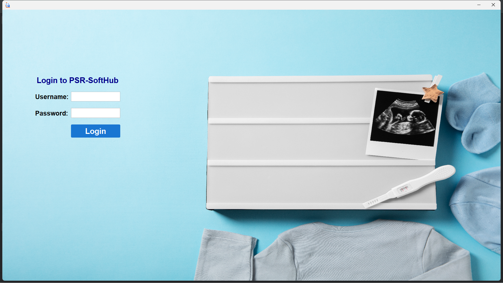

# Ultrasonography Report Generator 🏥📄

<div align="center">
  
  
  
  <br>
  
  
  
  
</div>

<br>

A professional Java desktop application for generating ultrasound examination reports with PDF output. Designed for medical practitioners to streamline diagnostic documentation workflow.

> 
> 
> 
> 
> 

## ✨ Key Features

### 📋 Comprehensive Report Types
| Report Type | Description |
|-------------|-------------|
| **Minor USG Report** | For pregnancies up to 10 weeks gestation |
| **Major USG Report** | For pregnancies beyond 10 weeks gestation |
| **Photo Copy Report** | Includes 6-8 sonography images with annotations |

### 🚀 Core Functionality
- **Dynamic PDF Generation** with professional formatting
- **Automated File Management** (saves to `~/Desktop/USReport`)
- **Patient Data Security** with proper record handling
- **Multi-image Support** for comprehensive photo documentation

### 🖥️ User Experience
- Intuitive Swing-based GUI with modern styling
- Input validation for data integrity
- Responsive design with clear error messaging
- Quick report generation (<5 seconds)

## 🛠️ Technical Specifications

 - Platform: Java SE 11+
 - GUI Framework: AWT/Swing
 - PDF Library: iText 7.2.3
 - Dependencies: See pom.xml
 - Build Tool: Maven

---

### 🧰 Prerequisites
- Java Runtime Environment (JRE) 11 or higher
- 4GB RAM (recommended)
- 200MB of free disk space

## Quick Start
## 🔧 Quick Start

```bash
git clone https://github.com/prathameshsingh-rajput/Ultrasonography-Report-Generator.git
cd Ultrasonography-Report-Generator
mvn clean install
java -jar target/usg-reporter-1.0.0.jar
```


## For Developers
  1. Import as Maven project in your IDE

  2. Add required dependencies:
  ```
    <dependency>
      <groupId>com.itextpdf</groupId>
      <artifactId>itext7-core</artifactId>
      <version>7.2.3</version>
    </dependency>
  ```
  3. Run MainFrame.java as entry point

---

## 🏥 Production Deployment
  
  - Currently deployed at: **Navoday Hospital Malkapur**
  - Since: July 2023
  - **Reports Generated: 1850+ (as of June 2025)**

  --- 

  ## 📂 Project Structure

```
  PSRSoftware/
├── src/
│   ├── main/
│   │   ├── java/
│   │   │   ├── org.prathameshsingh/
│   │   │   │       ├── LoginPanel.java         
│   │   │   │       ├── MainFrame.java
│   │   │   │       ├── MajorReportDatabase.java
│   │   │   │       ├── MajorReportMainPanel.java
│   │   │   │       ├── MajorReportPanel.java         
│   │   │   │       ├── MinorReportMainPanel.java
│   │   │   │       ├── MinorReportPanel.java
│   │   │   │       ├── PhotoReportMainPanel.java
│   │   │   │       ├── PhotoReportPanel.java
│   │   │   │       └── UltrasonographyReportSoftware.java    # Entry point
│   │   └── resources/                 # Assets & configs
├── target/                            # Build output
└── pom.xml                            # Maven config
```

---

## 🌟 Coming Soon

- Multi-language localization (Marathi/Hindi)

- Cloud sync capabilities

- Electronic signature support

- DICOM image integration

---

## 🤝 Contributing
We welcome medical professionals and developers to contribute:

1. Fork the repository

2. Create your feature branch (git checkout -b feature/improvement)

3. Commit your changes (git commit -am 'Add some feature')

4. Push to the branch (git push origin feature/improvement)

5. Open a Pull Request

---

<div align="center"> <sub>Built with ❤️ for better healthcare documentation</sub> </div>
